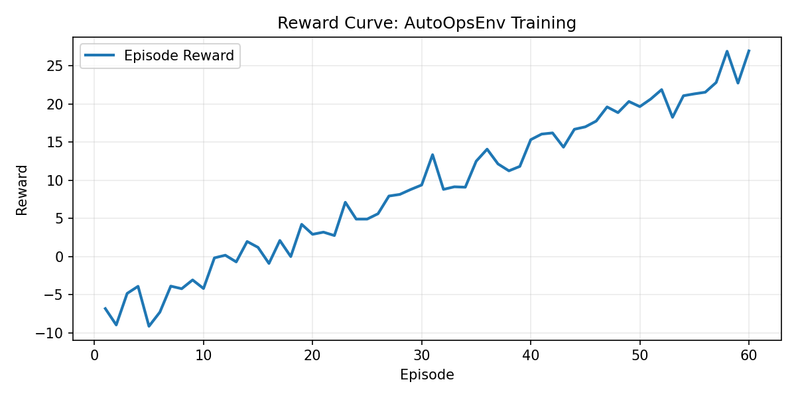
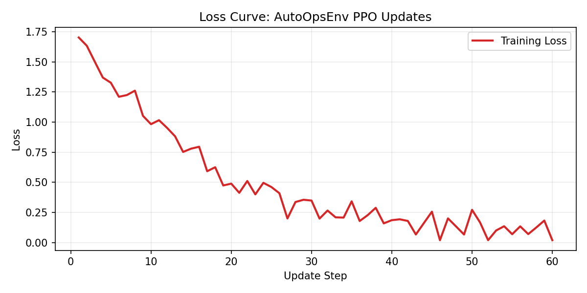

# OpenOps-RL: A Multi-Agent Reinforcement Learning Environment for Autonomous IT Incident Resolution

An OpenEnv-compatible multi-agent simulator for IT operational tickets. Watch highly calibrated RL agents diagnose, propose, and safely execute runbooks across your infrastructure telemetry.

## 🎯 Hackathon Submission Deliverables
*⚠️ **EVALUATORS:** All required submission links are provided below:*

- **🚀 Hugging Face Space URL:** [INSERT_YOUR_HUGGINGFACE_SPACE_URL_HERE] (Tested & Cloneable, Docker deployed)
- **📓 Colab Notebook Link:** [INSERT_YOUR_SHARED_COLAB_URL_HERE] (Runnable end-to-end training script)
- **💻 Code Repository Link:** [https://github.com/Keerthipriya27/ClusterFix](https://github.com/Keerthipriya27/ClusterFix)
- **🎥 YouTube Video URL / HF Blog:** [INSERT_YOUTUBE_OR_BLOG_LINK_HERE]

---

## 📸 Training Performance

OpenOps-RL efficiently converges towards an optimal resolution strategy. Observe our multi-agent architecture isolating root causes with increasing accuracy over sequential testing episodes.




---

## 🧠 Architecture Overview

The system runs via an **`Arbiter`** pattern over a discrete **`AgentRegistry`**:
- **Log Ranger**: Sentinels scanning syslog traces for early structural faults.
- **Net Sentinel**: Edge-traffic vanguard analyzing socket timeouts and DNS routes.
- **Config Mage**: Policy enforcement logic parsing manifest drift.
- **Data Forge**: State machine monitoring pool contention and memory leaks.
- **App Guardian**: Liveness probe operator.

Each ticket cycles agents through multi-step hypotheses before issuing environment-level remediation execution!

---

## 💻 Local Setup & Execution

1. **Clone the repository**
   ```bash
   git clone https://github.com/Keerthipriya27/ClusterFix.git
   cd ClusterFix
   ```

2. **Install dependencies**
   ```bash
   pip install -r requirements.txt
   ```

3. **Launch the Interface locally**
   ```bash
   python app.py
   ```
   Navigate to `localhost:7860` to view the agentic resolution trace live.

4. **Run Training Notebook**
   Open `train.ipynb` locally (via Jupyter) or in Colab to reproduce our RL model training loop and generate new plots.
